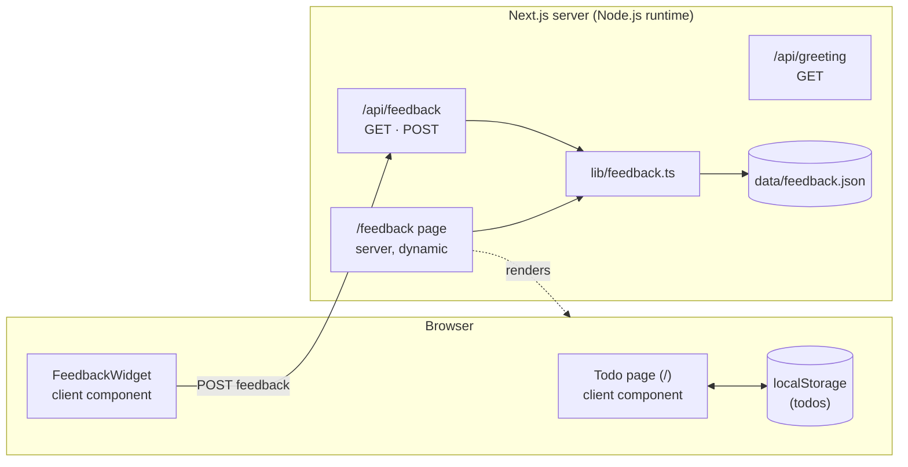

# Architecture

## Overview

Todo App is a single Next.js 14 App Router application. It has two data
paths that never touch a database:

- **Todos** live entirely in the browser (`localStorage`).
- **Feedback** is written server-side to a JSON file (`data/feedback.json`) via
  a Node.js API route.

## Data flows

### Todos (client-only)

The todo page is a `"use client"` component. It reads and writes an array of
todos to `localStorage`. Nothing is sent to the server; there is no sync.

### Feedback (client → server → file)

1. The `FeedbackWidget` (client) collects the message + context and `POST`s JSON
   to `/api/feedback`.
2. The route validates and normalizes the payload, stamps an `id` and
   `createdAt`, and calls `addFeedback()` in `lib/feedback.ts`.
3. `lib/feedback.ts` appends the entry to `data/feedback.json` (creating the
   `data/` directory on first write).
4. The `/feedback` page (server, `force-dynamic`) calls `readFeedback()` and
   renders submissions newest-first.

### Greeting (stateless)

`/api/greeting` returns a random greeting string as JSON. No storage, no input.

## Runtime constraints

!!! important "The feedback API must run on the Node.js runtime"
    `app/api/feedback/route.ts` sets `export const runtime = "nodejs"` because it
    writes to the filesystem. It cannot run on the Edge runtime.

- `/feedback` is `force-dynamic` so it always reflects the latest file contents.
- TypeScript strict mode is on — `npm run build` must pass with no type errors.

## Key modules

| Module                          | Responsibility                                  |
| ------------------------------- | ----------------------------------------------- |
| `app/page.tsx`                  | Todo UI + `localStorage` persistence (client).  |
| `app/components/FeedbackWidget.tsx` | Floating feedback button + form (client).   |
| `app/feedback/page.tsx`         | Server-rendered review page (dynamic).          |
| `app/api/feedback/route.ts`     | `GET`/`POST` feedback; Node.js runtime.         |
| `app/api/greeting/route.ts`     | `GET` a random greeting.                        |
| `lib/feedback.ts`               | Read/write helper for `data/feedback.json`.     |

See [Project Structure](project-structure.md) for the full tree.
